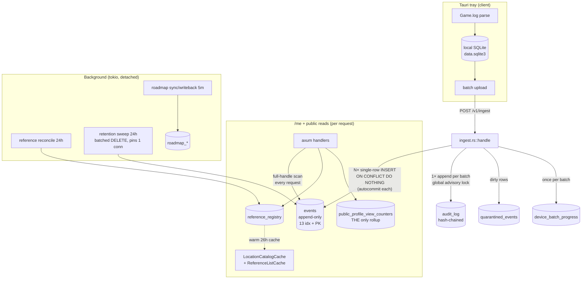
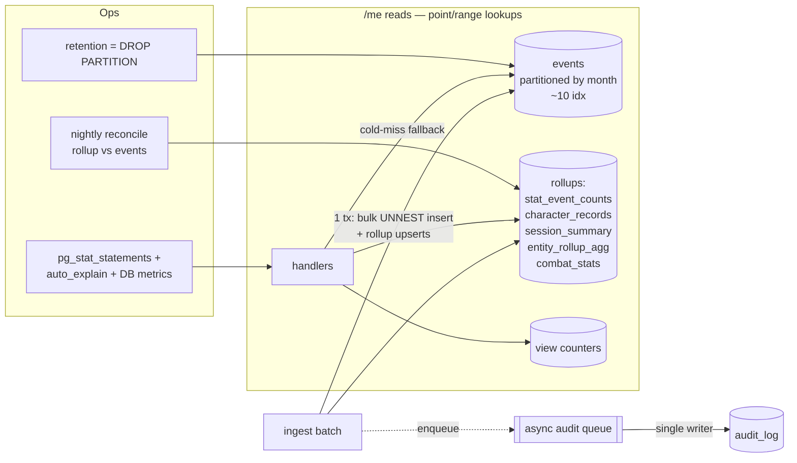

# StarStats — PostgreSQL Architecture & Performance Review

**Date:** 2026-07-22
**Scope:** `crates/starstats-server` (Rust + axum + sqlx → single PostgreSQL), migrations `0001`–`0050`, all data-access/stat-generation/ingestion/background-job paths.
**Method:** Static analysis of schema DDL + verbatim query text + data-access code (4 parallel read-only investigations). **No live database was available**, so all query-plan statements are labelled *hypothesis (validate with `EXPLAIN`)*. Nothing in the codebase was modified — this is analysis + a proposed plan awaiting approval.

> **⚠️ CONSTRAINT UPDATE (2026-07-22, mid-review): destructive changes are permitted.**
> The maintainer confirmed **the site is not live and all data is regenerable from the client device we work with.** This *lifts* the additive-only/byte-immutable-migration constraint below. Practical consequences that **override** the more cautious framing in §5/§8/§9/SCHEMA-1:
> - **`events` can be redefined as partitioned from the start** (drop + recreate, or rewrite `0001`), rather than the staged dual-write cutover in SCHEMA-1. Reparse from the client repopulates it.
> - **Dead indexes can be removed directly** (edit `0001`/`0003` or a plain `DROP INDEX` migration) — the `idx_scan=0` gate becomes a *nice-to-have*, not a precondition, since a wrong drop is cheap to undo on a non-live DB. `CONCURRENTLY` is unnecessary (no live writers to avoid blocking).
> - **The `LOWER()`-index cleanup (§5.4) becomes an immediate win**, not medium-term: strip `LOWER()` from the 23 query sites, add a `CHECK (claimed_handle = lower(claimed_handle))` to `events`, and use plain-column indexes for index-only scans.
> - **Migrations may be consolidated/rewritten** (50 incremental files → a clean baseline) since there's no shipped history to preserve. Recommended only if it doesn't cost more than it saves.
> - **Still non-negotiable:** correctness parity (rollups must match live computation), and *re-derivability* — every destructive step must be reproducible from a clean DB + a client reparse, so keep the schema and a seed/backfill path in version control.
>
> *The two constraints below were the original governing rules; they remain the reference for what changed, but the bullets above take precedence.*
>
> 1. ~~**Migrations are additive-only and byte-immutable post-deploy**~~ — **LIFTED** (see above).
> 2. **`CREATE/DROP INDEX CONCURRENTLY` cannot run inside a sqlx migration** — still true, but now **moot** since non-live means plain `DROP INDEX` is fine.

---

## 1. Executive Summary

**Overall health: good bones, one missing layer.** The SQL that exists is well-formed — parameterized throughout (no injection), keyset cursors on the main log view, window functions and `FILTER` used correctly, JSONB expression indexes that the entity queries actually hit, per-handle scoping discipline that means **no query ever aggregates `events` across all users**, and reference-data already protected by a warm 26 h in-memory cache. Transaction hygiene is clean: **no transaction spans an HTTP call, and no request handler holds a pooled connection across an outbound call** — the two classic idle-in-transaction failure shapes are absent.

The problems are **architectural, not query-tuning**, and cluster in four places:

1. **No derived-statistics layer.** Every `/me` dashboard widget recomputes from a full scan of the user's entire `events` history on every request. There is exactly one rollup table in the whole system (`public_profile_view_counters`) and it proves the pattern works — it just was never extended to the stats that need it (lives/records, combat, entity rollup, sessions, spend). This is the single largest performance and scalability risk as per-user history grows. *(Findings STAT-1…STAT-6)*

2. **Row-by-row ingestion.** A batch of N events is inserted with N single-row `INSERT`s in a Rust loop, each auto-committing (N round-trips, N fsyncs, no per-batch atomicity). *(Findings ING-1, ING-2)*

3. **A cluster-wide serialization point on the audit chain.** Every mutating request (including every ingest batch) takes a single global `pg_advisory_xact_lock` + `SELECT … ORDER BY seq DESC … FOR UPDATE` to extend the hash-chained `audit_log`. Combined with **16 max connections and no statement/lock/idle timeouts**, a burst of mutating requests can stack connections waiting on that one lock and exhaust the pool within the 5 s acquire window. *(Findings ING-3, POOL-1, POOL-2)*

4. **Write amplification on the hottest table.** `events` (append-only, unpartitioned, largest-growing) carries **13 secondary indexes + PK**, three of which became dead weight when migration 0045 lowercased all handles. It has a tiered retention policy (free = 90 d, supporter = ∞) implemented as batched `DELETE`s — the textbook case for time-range **partitioning** (drop partitions instead of deleting rows on a 14-index table). *(Findings IDX-1, SCHEMA-1)*

**Largest statistic-generation bottleneck:** the `/me` entities surface (`entity_rollup`) — a full grouped scan of the handle's metadata-tagged events **plus** a separate up-to-500 000-row pull into Rust to compute `session_count`, both on every render (`STAT-3`).

**Most serious scalability risk:** unbounded per-request full-history scans (`STAT-1/5/6`) — cost grows linearly with each user's lifetime event count, with no ceiling and no cache.

**Highest-value improvements, in order:** (A) incremental rollup tables maintained at ingest → point/range lookups instead of full scans; (B) bulk ingest insert in one transaction; (C) pool timeouts + audit-lock redesign; (D) drop the 3 dead `events` indexes and adopt partitioning; (E) `pg_stat_statements` so this review can be re-run on real data.

---

## 2. Current Architecture Map

### 2.1 Data-flow (ingest → store → read)



### 2.2 Workload classification

| Table | Profile | Growth | Notes |
|---|---|---|---|
| `events` | **write-heavy + read-heavy** | **Unbounded, fastest** | Every ingest writes; every `/me` widget scans. 13 idx. The whole review centres here. |
| `audit_log` | write-heavy (append) | Fast | Global-serialized appends; hash-chained; GROUP-BY on unindexed JSONB for share-view stats. |
| `reference_registry` | read-heavy | Slow (~2 k rows) | Multi-KB JSONB/row; **already cached** (26 h). |
| `users` + auth/token cols | mixed | Slow (1 row/user) | Wide row: many nullable token columns + 5 JSONB blobs (preferences, share_scopes, profile_layout, home_layout). |
| `public_profile_view_counters` | write + read | Medium | **The reference implementation** for the missing rollup layer. |
| `roadmap_*`, `submissions`, `revolut_*`, `waitlist_*` | low-traffic operational | Slow | Well-indexed; not hotspots. |
| `quarantined_events` | write (dirty batches) | Medium | Per-row insert inside ingest loop. |

### 2.3 Connection & transaction ownership

- **One pool, `max_connections=16`, `acquire_timeout=5 s`, no other tuning** (`main.rs:147`). Shared by all handlers + 7 background tasks. Migrations run inline at boot before `listen`.
- Retention sweep **pins 1 connection** for its full wall-time via a session-scoped advisory lock → **15 usable during a sweep**.
- Transactions (`.begin()`) are confined to store methods and contain **only SQL** — verified clean.

---

## 3. Findings Register

Severity: **Critical** (data-loss / outage risk) · **High** (major perf/scale) · **Medium** · **Low**. Complexity/Risk: S/M/L.

### Ingestion

**ING-1 — Row-by-row batch insert (no bulk / `UNNEST` / `COPY`)** · **High** · Cx M · Risk M
*Files:* `ingest.rs:833` (loop), `repo.rs:2144` (insert).
*Current:* `for envelope in &batch.events { store.insert(stored).await }`, each executing `INSERT INTO events (…) VALUES ($1..$11) ON CONFLICT (claimed_handle, idempotency_key) DO NOTHING RETURNING TRUE`. A 200-event batch = 200 round-trips.
*Root cause:* per-event `EventStore::insert` abstraction; no set-based path.
*Impact:* ingest latency scales with N × RTT; caps device upload throughput; amplifies audit-lock hold time.
*Fix:* single multi-row insert via `UNNEST` arrays (one round-trip); keep `ON CONFLICT DO NOTHING`. Return per-row inserted/duplicate via `RETURNING idempotency_key`.
*Validate:* batch-ingest throughput (events/s) before/after at N=50/200/1000; row counts identical; duplicate counts identical.

**ING-2 — No per-batch transaction (N autocommits)** · **High** · Cx S · Risk M
*Files:* `repo.rs:2168` (`.fetch_optional(&self.pool)` — pool, not tx).
*Current:* each of N inserts is its own implicit transaction → N fsyncs, no atomicity.
*Fix:* wrap the batch in one `pool.begin()…commit()` (independent of ING-1; stacks with it). Decide batch atomicity policy: all-or-nothing vs. per-row `ON CONFLICT` inside one tx (recommended — preserves current partial-accept semantics while collapsing fsyncs).
*Validate:* `pg_stat_database.xact_commit` delta per batch drops from ~N to ~1; ingest p50/p99 latency.

**ING-3 — Audit append is a cluster-wide serialization point** · **High** · Cx L · Risk L
*Files:* `audit.rs:194-253`.
*Current:* every batch/mutation runs `pg_advisory_xact_lock(AUDIT_LOG_ADVISORY_LOCK)` (one fixed global key) then `SELECT seq,row_hash FROM audit_log ORDER BY seq DESC LIMIT 1 FOR UPDATE`, INSERT, commit — while holding a pooled connection.
*Root cause:* a single linear hash chain requires a serialized tail read; the lock was added after a 2026-05-24 chain-break incident (documented in-module).
*Impact:* hard ceiling on concurrent mutation throughput; primary pool-exhaustion vector under load (see POOL-1).
*Fix (architectural):* (a) **async audit writer** — hand entries to an in-process queue drained by a single dedicated task/connection, so request handlers never block on the chain (append becomes fire-and-forget, matching the existing "audit is best-effort" invariant); or (b) **per-actor sub-chains** — shard the advisory lock and `prev_hash` by `actor_sub`, so unrelated users don't contend. (a) is lower-risk and preserves global ordering semantics loosely; (b) preserves strict per-user verifiability. Recommend (a) first.
*Validate:* concurrent-mutation throughput at 8/16/32 clients; connections-waiting-on-lock; audit chain still verifies end-to-end.

**ING-4 — Idempotency via `ON CONFLICT DO NOTHING`** · **Low (✅ correct)** — no read-before-write. Keep.

### Statistics / reads

**STAT-1 — Every `/me` stat is a fresh full-handle scan; no rollup layer** · **High** · Cx L · Risk M
*Files:* `repo.rs:1385` (`SELECT COUNT(*) … WHERE LOWER(claimed_handle)=LOWER($1)`), `repo.rs:1392` (type breakdown GROUP BY), + all widgets below.
*Root cause:* stats derived at query time; only `public_profile_view_counters` is materialized.
*Impact:* per-request cost ∝ user's lifetime event count; unbounded; uncached. Dominant scalability risk.
*Fix:* incremental rollup layer maintained at ingest (see §6). `public_profile_view_counters` is the proven template.
*Validate:* per-endpoint latency vs. history depth (10 k / 100 k / 1 M events); rows-read (`EXPLAIN ANALYZE, BUFFERS`).

**STAT-2 — Combat/spend/loadout/crash stats = 6+ separate aggregate scans/request** · **Medium** · Cx S · Risk L
*Files:* `query.rs:1483-1540` (combat: 2× `count_event_type` + `count(player_death)` + 3× `payload_field_breakdown`), `query.rs:1604,1672,1720` (spend/loadout/crash bundles).
*Fix:* collapse each bundle into **one** pass with `COUNT(*) FILTER (WHERE …)` and a single `GROUP BY … FILTER`. Immediate win, no schema change.
*Validate:* query count per combat-widget render 6→1; latency.

**STAT-3 — `/me` entities surface does two full scans of the same handle per render** · **High** · Cx M · Risk M
*Files:* `entity_rollup.rs:876` (`list_entities` GROUP BY, `entity_rollup.rs:381`) **and** `entity_rollup.rs:895` (`session_bounds_rows`, up to `SESSION_BOUNDS_HARD_CAP=500_000` rows pulled to Rust), then `for row in rows` (`entity_rollup.rs:696`) to tally `session_count`. Per-entity history endpoint pulls the 500 k set **again** (`entity_rollup.rs:1043`).
*Root cause:* module doc: `session_count is intentionally NOT computed in SQL`.
*Impact:* single most expensive `/me` surface; transfers up to 500 k rows over the wire per render.
*Fix:* compute `session_count` in SQL (`COUNT(DISTINCT session_id)` via the existing sessionizer), or serve from an `entity_rollup` rollup table maintained at ingest. Eliminate the second pull.
*Validate:* rows transferred per render; latency; `session_count` parity vs. current Rust result on historical data.

**STAT-4 — Lives/records FSM = two uncached full-history window scans/request** · **High** · Cx M · Risk M
*Files:* `repo.rs:1758` (`records_for_handle`): sessionization + per-session death `FILTER` scan, **plus** `repo.rs:1802` survival-streak `LAG` scan over every `player_death`. No memoization.
*Fix:* incremental `character_records` rollup (deepest session, deadliest session, longest survival gap) updated when new deaths/session boundaries ingest. Append-only source ⇒ trivially incremental.
*Validate:* parity of all 3 records vs. current across representative handles; latency.

**STAT-5 — `event_timeline::list_sessions` pulls unbounded history into Rust; duplicate of existing SQL sessionizer** · **High** · Cx S · Risk M
*Files:* `event_timeline.rs:296` (unbounded `SELECT … WHERE lower(claimed_handle)=lower($1) … ORDER BY event_timestamp` — **no LIMIT**), then `derive_sessions(&rows)` (`event_timeline.rs:350`); identical unbounded pull at `event_timeline.rs:421`. A pure-SQL sessionizer already exists at `repo.rs:1634` (`LAG` + cumulative-SUM window).
*Fix:* replace Rust sessionization with the SQL sessionizer; single source of truth. Quick win.
*Validate:* session boundaries parity vs. Rust output; rows transferred.

**STAT-6 — Over-fetch of `raw_line`/`payload` on timeline & entity reads** · **Medium** · Cx S · Risk L
*Files:* `entity_rollup.rs:466`, `event_timeline.rs:798` (`SELECT … raw_line, payload, metadata …` up to `EVENTS_PAGE_LIMIT_MAX=10_000`). `resolved_location` is also fetched then **discarded/recomputed** (`entity_rollup.rs:475→804`, anti-spoofing by design).
*Fix:* stop selecting `raw_line` where not rendered; stop selecting `resolved_location` where it's recomputed (dead bytes). `payload` is genuinely needed for envelope rendering — keep.
*Validate:* bytes-per-page in result set; `EXPLAIN (ANALYZE, BUFFERS)` shared/temp read.

### Indexing / schema

**IDX-1 — `events` carries 3 dead secondary indexes post-0045** · **High** · Cx S · Risk M (validation-gated)
*Evidence:* ingest forces lowercase (`ingest.rs:814`); read predicates are `LOWER(claimed_handle)=LOWER($1)` at **23** sites vs. exact-match at **2** (retention DELETE, users UPDATE). No cross-user `event_type`/time query exists (confirmed — `events` is never aggregated cross-user). So:
| Index | Verdict | Reason |
|---|---|---|
| `events_handle_seq_idx (claimed_handle, seq DESC)` [0003] | **DROP candidate** | Superseded by `events_lower_handle_seq_idx`; no exact-seq reader. |
| `events_type_idx (event_type)` [0001] | **DROP candidate** | Low-selectivity standalone; per-handle type served by `events_lower_handle_event_type_idx`; no cross-user type query. |
| `events_event_ts_idx (event_timestamp DESC) WHERE …` [0001] | **DROP candidate** | Global-by-time; no cross-user time query; per-handle time served by `events_lower_handle_ts_idx`. |
| `events_handle_hidden_idx (claimed_handle, seq DESC) WHERE hidden_at IS NOT NULL` [0024] | **Verify** | On exact `claimed_handle`; if hidden query uses `LOWER()`, it's unused. Tiny partial → low priority. |
| `events_metadata_inferred` [0030] | **Verify** | Confirm provenance query uses it. |
*Impact:* removing 3 cuts secondary-index maintenance on the hot table by ~23 % (13→10) → faster ingest, less bloat, smaller WAL.
*Fix:* **out-of-band runbook** `DROP INDEX CONCURRENTLY` (cannot be a migration) — *gated on* `pg_stat_user_indexes.idx_scan = 0` for each over a full traffic cycle. **Decision rule honoured: do not drop without validating actual usage.**
*Validate:* `SELECT indexrelname, idx_scan FROM pg_stat_user_indexes WHERE relname='events';` before drop; ingest throughput after.

**SCHEMA-1 — `events` is unpartitioned despite append-only + tiered retention** · **High** · Cx L · Risk L
*Current:* single heap; free-tier purge = batched `DELETE` (`retention.rs:156`) over a 14-index table → dead tuples, bloat, autovacuum load.
*Fix:* range-partition `events` by `received_at` (monthly). Free-tier retention becomes `DETACH`/`DROP PARTITION` (instant, no dead tuples). Requires a table swap (new partitioned parent + attach), so it's a **medium-term, staged** change — additive-migration constraint means building the partitioned table alongside and cutting over. Supporter data (∞ retention) stays; only old free partitions drop — but partitions mix tiers, so keep the row-level `DELETE` for free rows inside retained partitions and use partition-drop only for partitions entirely older than the *longest* retention. Net: far less `DELETE` churn.
*Validate:* autovacuum frequency on `events`; bloat ratio; retention wall-time.

**SCHEMA-2 — `users` is a wide hot row (auth tokens + 5 JSONB blobs)** · **Low/Medium** · Cx M · Risk M
*Current:* `users` accretes many nullable token columns (email/reset/rsi/totp/pending) + `preferences`, `share_scopes`, `profile_layout`, `home_layout`, `hangar`-adjacent snapshots elsewhere. Auth flows update token columns frequently → HOT-update pressure on a wide row.
*Fix (optional, medium-term):* split volatile single-use tokens into a narrow `user_auth_tokens` table; keep durable identity on `users`. Reduces row width and HOT-update churn. Low urgency (1 row/user).

### Pooling / transactions / ops

**POOL-1 — 16 connections, no statement/lock/idle timeouts, audit-lock contention** · **High** · Cx S · Risk M
*Files:* `main.rs:147`; absence confirmed repo-wide.
*Current:* no `statement_timeout`, `lock_timeout`, `idle_in_transaction_session_timeout`, `max_lifetime`, `idle_timeout`, `min_connections`. `acquire_timeout(5 s)` bounds checkout only, not query runtime. Under an audit-lock burst (ING-3), waiters hold connections; 15 usable during a retention sweep.
*Fix:* add `after_connect` setting `SET statement_timeout`, `lock_timeout`, `idle_in_transaction_session_timeout` (per-workload values — generous for background, tight for request handlers via `SET LOCAL`); add `max_lifetime`/`idle_timeout`; raise `max_connections` only after ING-3 is addressed (more connections into the same lock just moves the queue). **Do not raise blindly** — sum of pool + background holders vs. server `max_connections` must stay within Postgres capacity.
*Validate:* pool-timeout error rate under load test; connections-in-use during sweep; a deliberately slow query is now killed by `statement_timeout`.

**POOL-2 — Boot blocks on non-concurrent `events` index build + full-table UPDATE** · **Medium (one-time/deploy)** · Cx S · Risk L
*Files:* `0044_events_lower_handle_idx.sql` (3× non-concurrent `CREATE INDEX ON events` — blocks ingest during build), `0045_normalize_event_handles.sql` (un-batched full-table `UPDATE events SET claimed_handle=LOWER(...)`). Boot waits before `listen` (`main.rs:153→1052`), interacting with the Komodo stop-first / CDN-negative-cache deploy gap.
*Fix (forward-looking):* future large-table index migrations should ship as **empty migrations + an out-of-band `CONCURRENTLY` runbook**, and large data transforms should be **batched jobs**, not boot-blocking migrations. (0044/0045 already shipped — this is guidance for the next one.)

**OBS-1 — No database query observability** · **High (enabler)** · Cx S · Risk L
*Current:* `pg_stat_statements`, `auto_explain`, `log_min_duration_statement` absent; Prometheus covers HTTP only; sqlx uses runtime `query()` (no compile-time schema check).
*Impact:* slow queries invisible until a user complains; this review can't use real plans.
*Fix:* enable `pg_stat_statements` (extension + `shared_preload_libraries`); set `log_min_duration_statement` (e.g. 500 ms) + `auto_explain` for the slow tail; export a small set of DB metrics (pool in-use/waiters, per-endpoint query count + duration histogram, ingest events/s, rollup lag). Each metric must answer an operational question — no vanity dashboards.
*Validate:* top-20 by total time visible in `pg_stat_statements`; re-run §4 inventory against real data.

### JSONB / misc

**JSON-1 — `reference_resolve` is a per-class N-query loop bypassing the warm cache** · **Medium/High** · Cx S · Risk L
*Files:* `reference_resolve.rs:99` calls `store.get_entry(cat, class)` (`reference_store.rs:509`) **once per class name**, up to 200/request, each pulling the full `metadata` blob, straight to Postgres (not the cache).
*Fix:* batch via `WHERE category=$1 AND lower(class_name)=ANY($2)`, project only needed fields, and/or serve from `LocationCatalogCache`. Immediate win.
*Validate:* query count per resolve request (N→1); latency.

**JSON-2 — `audit_log` share-view rollup GROUPs on unindexed `lower(payload->>'owner_handle')`** · **Medium** · Cx S · Risk L
*Files:* `audit.rs:384` — filtered by `action='share.viewed'` only; scans that action slice.
*Fix:* add index on `audit_log (action, occurred_at)` (already partially present) and, if this grows, an expression index on `lower(payload->>'owner_handle')` filtered `WHERE action='share.viewed'`. Or fold share-view counts into a rollup like `public_profile_view_counters`.

**JSON-3 — Per-handle `payload->>$field` GROUP BY unindexed** · **Medium (bounded)** · Cx M · Risk L
*Files:* `repo.rs:2063` (`payload_field_breakdown`), `repo.rs:1955`, `1855`. Bounded by the `(LOWER(handle), event_type)` prefix index, so scoped to one handle+type — fine now, **catastrophic if ever run cross-user**. Fold into STAT rollups rather than add many payload expression indexes.

---

## 4. Query Inventory (hot paths)

*Latency/rows columns are **hypotheses** pending `pg_stat_statements` (OBS-1). "Scan" = full scan of the handle's entire history.*

| # | Query (fingerprint) | Caller | Freq | Rows examined | Plan concern | Index used | Action |
|---|---|---|---|---|---|---|---|
| Q1 | `SELECT COUNT(*) … LOWER(claimed_handle)=LOWER($1)` | `repo.rs:1385` summary | every /me | all handle events | full agg | `events_lower_handle_*` | rollup (STAT-1) |
| Q2 | type breakdown `GROUP BY event_type` | `repo.rs:1392` | every /me | all handle events | full agg | lower_handle | rollup |
| Q3 | entity `GROUP BY metadata→entity` | `entity_rollup.rs:381` | entities | all metadata events | grouped scan | `events_metadata_entity` ✅ | rollup (STAT-3) |
| Q4 | `session_bounds_rows` ≤500k → Rust | `entity_rollup.rs:522` | entities | ≤500k | huge transfer | lower_handle_ts | SQL `COUNT(DISTINCT)` / rollup |
| Q5 | records: session `FILTER` + `LAG` streak (×2) | `repo.rs:1758,1802` | records widget | all handle events ×2 | 2 full scans, uncached | lower_handle_ts | rollup (STAT-4) |
| Q6 | `list_sessions` unbounded → Rust | `event_timeline.rs:296` | sessions | all handle events | no LIMIT, dup logic | lower_handle_ts | use SQL sessionizer (STAT-5) |
| Q7 | combat 6× scans | `query.rs:1483` | combat widget | all handle events ×6 | 6 passes | lower_handle_type | `FILTER` fold (STAT-2) |
| Q8 | `list_filtered` keyset on seq | `repo.rs:1274` | Logs view | page | ✅ keyset | lower_handle_seq | drop `raw_line` over-fetch (STAT-6) |
| Q9 | discover listing + per-row `MAX(event_timestamp)` LATERAL | `discover_routes.rs:228` | discover | N (page) index probes | bounded by 0044 | lower_handle_ts ✅ | watch at scale |
| Q10 | ingest single-row INSERT ×N | `repo.rs:2144` | ingest | — | N round-trips | idem_uq ✅ | bulk `UNNEST` (ING-1) |
| Q11 | audit append (advisory lock + tail FOR UPDATE) | `audit.rs:194` | every mutation | 1 | global serialization | seq_uq | async writer (ING-3) |
| Q12 | retention batched DELETE (ctid, 1000) | `retention.rs:156` | 24h sweep | ≤1000/batch | ✅ index-served | `events_handle_received_idx` ✅ | partition-drop (SCHEMA-1) |
| Q13 | `reference_resolve` per-class `get_entry` ×N | `reference_resolve.rs:99` | resolve | N | N queries + full blob | class_lower | batch `ANY` (JSON-1) |

---

## 5. Index Report

### 5.1 Add
| Index | Rationale | Read benefit | Write/storage cost |
|---|---|---|---|
| `audit_log (action, occurred_at DESC)` — *verify not already covered by `audit_log_action_idx`* | JSON-2 share-view slice | Bounds `action='share.viewed'` scan | Low; audit is append-only |
| *(rollup-table indexes)* — defined per rollup in §6 | Point/range stat lookups replace full scans | Very high | Paid on rollup upsert |

**No new indexes on `events` are recommended** — the write-amplification cost outweighs benefit, and the missing performance is better recovered by rollups (§6). JSON-3 payload fields deliberately **not** indexed.

### 5.2 Remove (out-of-band `DROP INDEX CONCURRENTLY`, gated on `idx_scan=0`)
| Index | Confidence | Gate |
|---|---|---|
| `events_handle_seq_idx` | High (23-vs-2 predicate evidence) | `idx_scan=0` over full cycle |
| `events_type_idx` | High (no cross-user type query) | `idx_scan=0` |
| `events_event_ts_idx` | High (no cross-user time query) | `idx_scan=0` |
| `events_handle_hidden_idx` | Verify (predicate-form mismatch) | check hidden-query form + `idx_scan` |
| `events_metadata_inferred` | Verify | `idx_scan` |

### 5.3 Keep (justified)
`events_handle_idem_uq` (ON CONFLICT target), `events_seq_uq`, `events_handle_received_idx` (**retention path** — corrects an earlier "no received_at index" assumption), `events_lower_handle_{ts,seq,event_type}_idx` (the 23 read sites), `events_metadata_group_key`, `events_metadata_entity`.

### 5.4 Longer-term option
Since data is invariantly lowercase, the mirror cleanup — **drop the `LOWER()` expression indexes, strip `LOWER()` from 23 query sites, add plain-column `(claimed_handle, …)` indexes enabling index-only scans** — is valid and arguably cleaner, but touches 23 call sites and the immutable-migration constraint. Defer to medium-term; add a `CHECK (claimed_handle = lower(claimed_handle))` (via `NOT VALID` + later `VALIDATE`) first to formalize the invariant.

---

## 6. Statistic-Generation Redesign

**Principle:** the source (`events`) is append-only and never mutates history (except `hidden_at`), so every stat below is **incrementally maintainable** at ingest — exactly what `public_profile_view_counters` already does. Each rollup gets: source, grouping key, update trigger, rebuild path, correction behaviour, consistency, failure recovery, indexes, validation.

| Rollup | Source | Grouping key | Update trigger | Rebuild | Corrections | Consistency | Validation |
|---|---|---|---|---|---|---|---|
| `stat_event_counts` (total + per-type) | `events` | `(claimed_handle, event_type)` | ingest: `INSERT … ON CONFLICT DO UPDATE SET count=count+excluded.count` | `INSERT…SELECT GROUP BY` from `events` | `hidden_at` set ⇒ decrement (or recompute) | eventual (ms) | `SELECT` parity vs. `repo.rs:1385/1392` |
| `character_records` | death/session events | `claimed_handle` | ingest: update deepest/deadliest/streak | full recompute from `records_for_handle` SQL | new death may extend streak (monotonic) | eventual | parity vs. `repo.rs:1758` |
| `session_summary` | non-launcher events | `(claimed_handle, session_id)` | ingest: extend/close current session | SQL sessionizer `repo.rs:1634` | late event may merge sessions → recompute affected day | eventual | boundary parity vs. Rust `derive_sessions` |
| `entity_rollup_agg` | metadata events | `(claimed_handle, kind, id)` | ingest: bump count/last_seen; incr `session_count` on new session | `entity_rollup.rs:381` + `COUNT(DISTINCT session_id)` | display_name = latest | eventual | parity incl. `session_count` |
| `combat_stats` | actor/player_death | `(claimed_handle, day)` + payload buckets | ingest: `FILTER` counters | one `GROUP BY … FILTER` pass | — | eventual | parity vs. `query.rs:1483` |

**Ownership & wiring:** rollups are updated in the **ingest transaction** (same tx as ING-2's batch insert) so they can never silently drift from `events`; a nightly **reconcile job** recomputes from source and alerts on mismatch (closing the "green while doing nothing" failure mode). Reads switch to point/range lookups on the rollup, falling back to live computation only on a rollup miss (cold user). **Correctness gate (decision rule):** ship each rollup behind a comparison harness that runs the new lookup and the old full-scan side-by-side across representative historical handles and diffs the results before the old path is retired.

**What stays live (not materialized):** anything needing exact real-time accuracy on the current request that isn't hot (admin one-offs), and the Logs keyset view (already efficient).

---

## 7. Target Architecture



- **Operational data:** `users`, auth (optionally split per SCHEMA-2), reference.
- **Raw event data:** `events`, partitioned; retention by partition drop + row-DELETE for mixed-tier partitions.
- **Derived/aggregated:** rollup tables owned by the ingest path, reconciled nightly.
- **Caching:** unchanged for reference (already good); rollups replace the need to cache stat *queries*.
- **Background:** unchanged cadences; audit moves to async single-writer.
- **Observability:** `pg_stat_statements` + slow log + a lean DB metric set.
- **Data-access boundary:** keep the `Trait + Postgres impl + Memory impl` store pattern; add rollup methods there so the abstraction still hides SQL but no longer hides *full scans*.

---

## 8. Prioritized Implementation Roadmap

**Immediate safe wins** (no schema change; independently shippable, low risk):
1. **STAT-2 / STAT-7 query folds** — combat 6→1 `FILTER`; collapse spend/loadout/crash bundles. *Accept:* query count drops, parity tests green.
2. **STAT-5** — swap `event_timeline` Rust sessionization for the SQL sessionizer (`repo.rs:1634`). *Accept:* session-boundary parity.
3. **STAT-6** — drop `raw_line`/`resolved_location` over-fetch. *Accept:* result bytes/page down, UI unchanged.
4. **JSON-1** — batch `reference_resolve`. *Accept:* N→1 queries.
5. **OBS-1** — enable `pg_stat_statements` + slow log. *Accept:* top-N visible. *(Do this first so 1–4 are measured on real data.)*
6. **POOL-1 (timeouts only)** — `after_connect` statement/lock/idle timeouts + `max_lifetime`. *Accept:* slow query gets killed; no behaviour change.

**Short-term structural:**
7. **ING-2 then ING-1** — batch transaction, then bulk `UNNEST` insert. *Accept:* commits/batch ~N→1; throughput up; row/dup parity. *Rollback:* feature-flag the bulk path, keep the loop.
8. **IDX-1** — validate `idx_scan`, then `DROP INDEX CONCURRENTLY` the 3 dead indexes (runbook). *Accept:* ingest throughput up, no plan regressions. *Rollback:* recreate concurrently.

**Medium-term architectural:**
9. **Rollup layer (§6)**, one stat family at a time behind a comparison harness, updated in the ingest tx + nightly reconcile. Order: `stat_event_counts` → `character_records` → `entity_rollup_agg` → `session_summary` → `combat_stats`. *Accept:* endpoint latency independent of history depth; reconcile diff = 0. *Rollback:* reads fall back to live computation (kept behind a flag).
10. **ING-3** — async audit writer. *Accept:* concurrent-mutation throughput up; chain still verifies. *Rollback:* revert to synchronous append.
11. **SCHEMA-1** — partition `events`; retention → partition drop. *Accept:* autovacuum/bloat down; retention wall-time down. *Rollback:* cut back to the heap table (kept during a dual-write window).

**Optional long-term:**
12. SCHEMA-2 token-table split; the "strip `LOWER()` + plain-column indexes" cleanup (§5.4); separate analytical read replica if reporting ever competes with OLTP (not needed today — no cross-user aggregation exists).

**Dependencies:** OBS-1 gates measurement of everything; ING-2 precedes ING-1; rollups (9) depend on the ingest-tx path from ING-2; partitioning (11) is independent but easiest after rollups reduce read reliance on `events`.

---

## 9. Proposed Code Changes (illustrative — not yet applied)

> Presented for approval per the working method (implement only after findings are accepted). Each would ship as its own small, reviewable change with tests.

**ING-1/2 — bulk insert in one transaction (sketch):**
```rust
// repo.rs — replace the per-row loop with one set-based insert
let mut tx = self.pool.begin().await?;
let inserted: Vec<String> = sqlx::query_scalar(
    r#"INSERT INTO events (id, idempotency_key, claimed_handle, event_type,
           event_timestamp, log_source, source_offset, raw_line, payload, metadata, resolved_location)
       SELECT * FROM UNNEST(
           $1::uuid[], $2::text[], $3::text[], $4::text[], $5::timestamptz[],
           $6::text[], $7::bigint[], $8::text[], $9::jsonb[], $10::jsonb[], $11::jsonb[])
       ON CONFLICT (claimed_handle, idempotency_key) DO NOTHING
       RETURNING idempotency_key"#)
    .bind(&ids).bind(&idem).bind(&handles) /* … */
    .fetch_all(&mut *tx).await?;
// rollup upserts here, same tx …
tx.commit().await?;
```

**STAT-2 — combat fold (sketch):**
```sql
SELECT
  COUNT(*) FILTER (WHERE event_type='actor_death' AND payload->>'role'='killer') AS kills,
  COUNT(*) FILTER (WHERE event_type='actor_death' AND payload->>'role'='victim') AS deaths_pvp,
  COUNT(*) FILTER (WHERE event_type='player_death')                              AS deaths_total
FROM events
WHERE LOWER(claimed_handle)=LOWER($1)
  AND ($2::timestamptz IS NULL OR event_timestamp >= $2);
```

**POOL-1 — pool timeouts (sketch):**
```rust
let pool = PgPoolOptions::new()
    .max_connections(16)
    .acquire_timeout(Duration::from_secs(5))
    .max_lifetime(Duration::from_secs(30 * 60))
    .idle_timeout(Duration::from_secs(10 * 60))
    .after_connect(|conn, _| Box::pin(async move {
        sqlx::query("SET statement_timeout = '15s'; \
                     SET lock_timeout = '3s'; \
                     SET idle_in_transaction_session_timeout = '30s'")
            .execute(conn).await?; Ok(())
    }))
    .connect(&cfg.database_url).await?;
```

**§6 rollup migration (sketch — new `0051_stat_event_counts.sql`, additive):**
```sql
CREATE TABLE IF NOT EXISTS stat_event_counts (
    claimed_handle TEXT   NOT NULL,
    event_type     TEXT   NOT NULL,
    event_count    BIGINT NOT NULL DEFAULT 0,
    updated_at     TIMESTAMPTZ NOT NULL DEFAULT NOW(),
    PRIMARY KEY (claimed_handle, event_type)
);
-- backfill runs as a batched job, NOT inline (POOL-2 lesson)
```

*Exact column/table names above are verified against the current schema; final SQL to be confirmed against the live DB before shipping.*

---

## 10. Benchmark Plan

Repeatable, same data + conditions, baseline vs. improved. Requires OBS-1 first.

| Target | Metric | Method | Cold/Warm |
|---|---|---|---|
| `/me` dashboard endpoints | p50/p95/p99 latency; rows-read; buffers | `EXPLAIN (ANALYZE, BUFFERS, WAL)` + endpoint timing at 10k/100k/1M-event synthetic handles | both |
| Entities surface (STAT-3) | rows transferred; latency | before/after SQL `session_count` | warm |
| Ingest throughput (ING-1/2) | events/s; commits/batch (`xact_commit` delta); p99 | load-gen batches N=50/200/1000 | warm |
| Audit under concurrency (ING-3) | mutations/s; connections waiting on lock | 8/16/32 concurrent mutating clients | warm |
| Retention (SCHEMA-1) | sweep wall-time; dead tuples; bloat | `pgstattuple` before/after | — |
| Rollup correctness (§6) | diff count new-vs-old | comparison harness over historical handles | — |
| Pool (POOL-1) | pool-timeout error rate; in-use during sweep | load test + `pg_stat_activity` sampling | — |
| DB resource | CPU, I/O, WAL bytes/s, temp files, lock waits | `pg_stat_*` sampling during each run | both |

**Acceptance:** stat-endpoint latency becomes independent of history depth; ingest commits/batch ≈1; no cross-user aggregation introduced; every rollup diff = 0 vs. the retired full-scan path; all existing tests green.

---

### Appendix — Decision-rule compliance
Evidence over generic best practice (all findings cite `file:line` + verbatim SQL); set-based over row-by-row (ING-1, STAT-2); reduce work over micro-optimize (rollups over more indexes); no caching added before understanding the source query; no denormalization/materialization without a defined update+rebuild+reconcile path (§6); no index added without weighing write cost, none removed without an `idx_scan` gate; no approximate stats where exact are required (rollups are exact, incrementally); no new infra proposed to dodge a bad query; no externally-visible behaviour changed silently (each change gated by parity tests); ORM SQL examined directly (verbatim); dev-scale never assumed to equal prod (all plan claims labelled hypotheses pending OBS-1).
